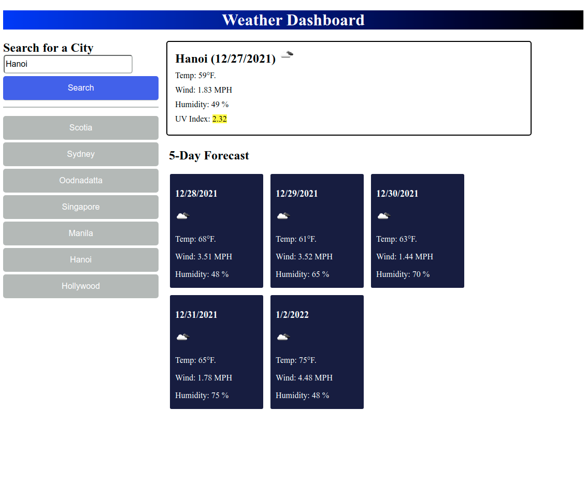

# weather-dashboard

## Description
Provides current and 5-day weather outlook for any city named.  Also,
in the session context, maintains a history of previous city weather searches
that can be retrieved again at the press of a button and will re-populate the 
page with the previous query's results (no extra API lookup required).

## Sample Image

## Future Considerations
Provide a "Save History" and "Clear History" button to maintain previous weather
lookups across sessions (use local storage);

